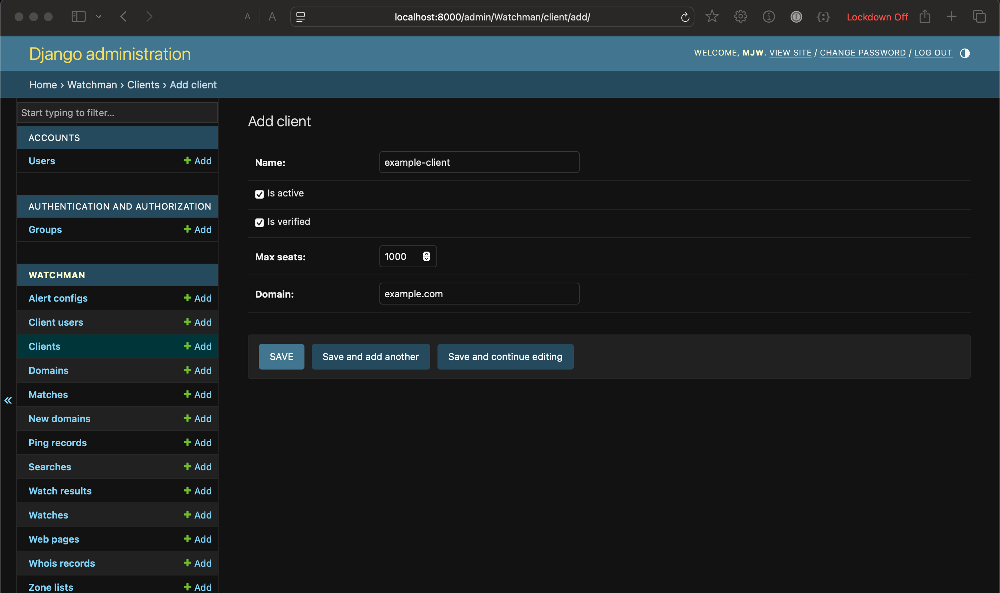
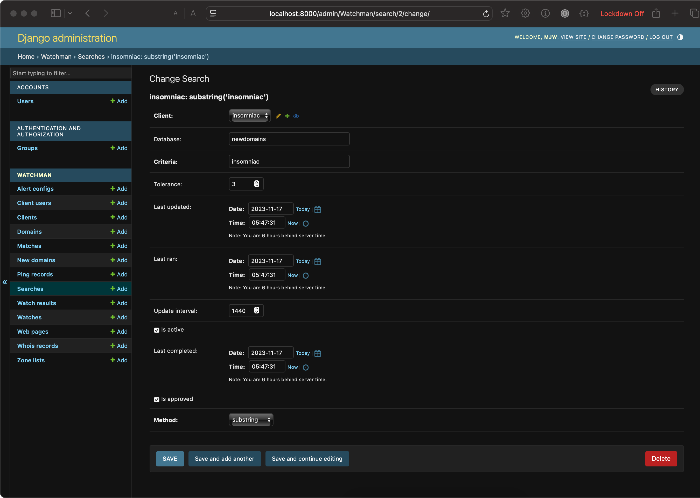
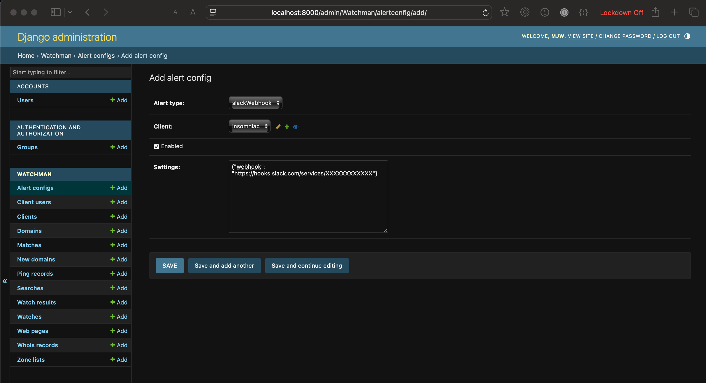
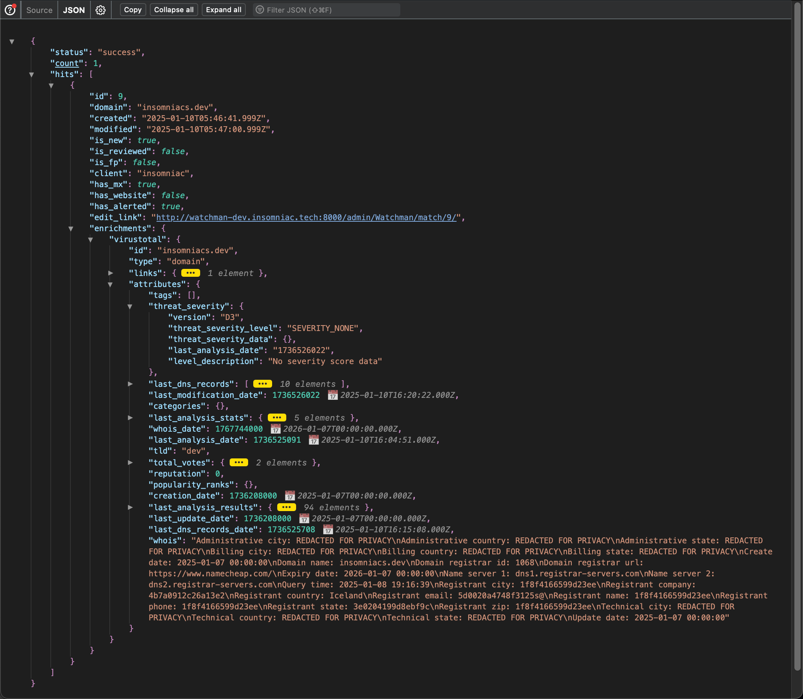
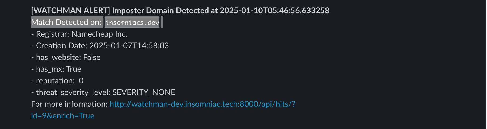
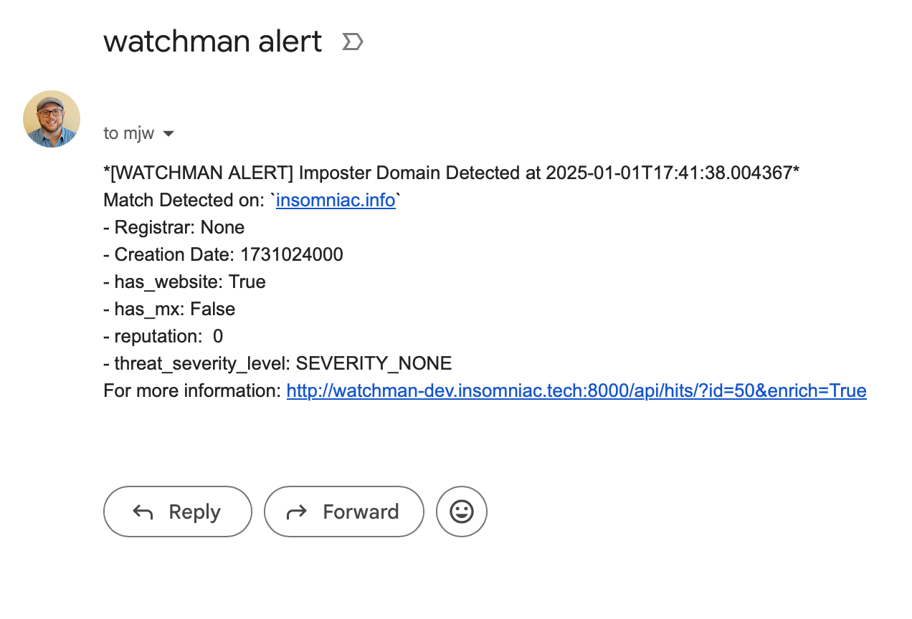

# Watchman
Watchman is a security tool that watches domains and fqdns. You can read more about it here: https://docs.google.com/presentation/d/10TtlZO01WfJo9raF-ShS06m5bak1NSG1/edit#slide=id.g324938c8159_1_85

## Setup
1. git clone https://github.com/mwollenweber/Watchman.git
2. cd Watchman
2. cp example-config.rc config.rc
3. nano config.rc
4. sudo ./install.sh

### Add a Client
- http://localhost:8000/admin/Watchman/client/add/

### Add a Search
- http://localhost:8000/admin/Watchman/search/add/
I recommend adding the domain - (minus the) tld as a substring match and the domain+tld as str distance. So for insomniac.tech I monitor for the substring 'insomniac'

### Add Alert Config
http://localhost:8000/admin/Watchman/alertconfig/

## Run a daily zone update + match + alerts
1. ./daily-run.sh 

## Other Commands
### Update a Specific Zone:
Update a specific TLD. For Example, update .com: 
- python manage.py update_zone com

### See Search Results
- Browse to http://localhost:8000/hits/

### Example Slack Alert

### Example Email Alert

### Public Hits
http://localhost:8000/api/public_hits

### Check if a Domain is a Newly Observed Domain (NOD)
http://localhost:8000/api/isnod/?domain=insomniac.tech

### List all Newly Observed Domains (NODs)
http://localhost:8000/api/newdomains/

### Run Celery
TODO
